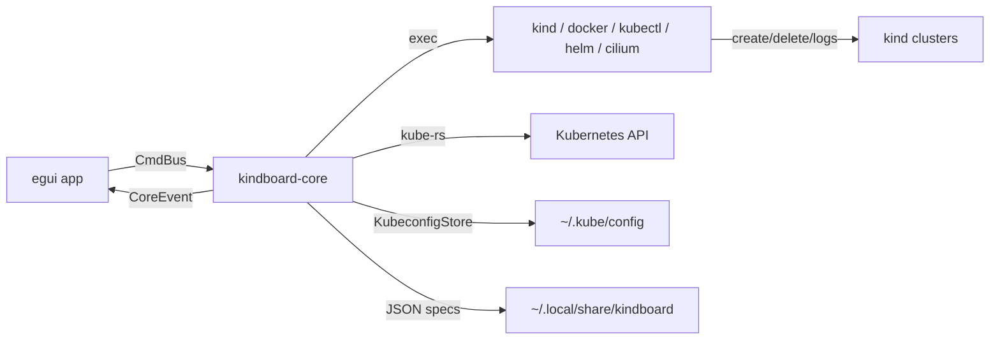

# kindboard

A fully open-source desktop dashboard to run and manage [kind](https://kind.sigs.k8s.io) (Kubernetes-in-Docker) clusters on Linux and macOS — built in Rust as a local development environment for testing your apps.


> by Orlando Rosa Pereira — [github.com/Orpere](https://github.com/Orpere)

---

## Features

- **Multiple clusters, different settings** — name, Kubernetes version, CNI (kindnet default, flannel, calico, cilium), pod/service CIDR, feature gates, extra port mappings, worker count.
- **Cilium extras** — checkboxes for API Gateway, Hubble, Ingress Controller and Mesh (clustermesh); enabling Mesh opens a per-cluster ID form (cluster-id + cluster-name).
- **Ingress controller choice** — nginx, traefik or cilium, with automatic host-port mapping (80/443).
- **Dependency manager** — detects and installs docker, kind, kubectl, helm, cilium CLI, k9s, kubectx and kustomize (brew / dnf / apt / pacman first, official binaries with SHA-256 verification as fallback), including the docker daemon state.
- **Kubeconfig lifecycle** — every cluster is added as a context to your default kubeconfig on create and removed on destroy (verified and repaired even for clusters created outside the app).
- **Per-cluster tabs with a live topology diagram** — namespaces, workloads, pods, services and ingresses as a layered graph with status colors, pan/zoom, click-to-inspect and opt-in auto-refresh.
- **Log watching** — node containers via `docker logs -f` and workload pods via `kubectl logs -f`, in bounded, follow-mode ring buffers.
- **Full cluster management** — scale workers, delete nodes (guided recreate from saved settings — kind has no node-level commands), destroy with a type-the-name confirmation popup, and export logs/kubeconfig.

> **Scaling note:** kind fixes the node topology at creation time. kindboard implements
> "scale workers" / "delete node" as a one-click guided recreate that preserves all
> cluster settings, with an explicit workload-loss warning.

## Requirements

- **Docker** (running) — the only hard requirement; kindboard itself can install kind, kubectl, helm, cilium CLI, k9s, kubectx and kustomize from the Dependencies panel.
- Linux (Fedora / Ubuntu / Arch) or macOS.
- A graphical session (X11 or Wayland).

## Quick start

**Prebuilt binary** — download `kindboard-<os>-<arch>.tar.gz` from the [Releases](https://github.com/Orpere/kindboard/releases) page (or run `scripts/build.sh` to produce `dist/` yourself), extract, run `./kindboard`.

**From source** (Rust 1.98+):

```bash
make run        # run the app in debug mode
make build      # full gates + release artifacts in dist/ + SHA256SUMS
make build-all  # also try linux aarch64 and darwin targets (skips unbuildable ones)
```

## Make targets

| Target | Purpose |
|---|---|
| `make run` | Run the desktop app (debug) |
| `make check` | All quality gates: `fmt --check`, `clippy -D warnings`, tests |
| `make test` | Unit + integration tests (e2e skipped unless `KINDBOARD_E2E=1`) |
| `make e2e` | Full suite including real-kind e2e (requires docker + kind; throwaway `kbtest-*` clusters) |
| `make audit` | RustSec advisory scan (needs `cargo install cargo-audit`) |
| `make build` / `make dist` | Release build into `dist/` + `SHA256SUMS` (runs all gates first) |
| `make build-all` | Attempt all four targets: linux x86_64/aarch64, darwin x86_64/arm64 |
| `make assets` | Fetch + resize the official logos into `assets/` (ImageMagick) |
| `make clean` | Remove build artifacts and `dist/` |
| `make help` | List all targets |

Scripts: `scripts/build.sh` (release pipeline, reproducible tarballs) · `scripts/prepare-assets.sh` (logo pipeline). No GitHub Actions — builds are local by design.

## Documentation

| Doc | Contents |
|---|---|
| [docs/architecture.md](docs/architecture.md) | System graph, crate layout, async model, failure modes |
| [docs/contracts.md](docs/contracts.md) | Type-level contracts: spec, commands, provisioning, topology |
| [docs/dependency-install-matrix.md](docs/dependency-install-matrix.md) | Detection, package names, pinned binary downloads per tool |
| [docs/adrs/](docs/adrs/) | Architecture decision records (ADR-0008 … 0012) |
| [assets/ATTRIBUTION.md](assets/ATTRIBUTION.md) | Logo ownership, sources and trademark notes |



## License & attribution

[MIT](LICENSE) © 2026 Orlando Rosa Pereira. Project logos belong to their respective owners — see [assets/ATTRIBUTION.md](assets/ATTRIBUTION.md).
