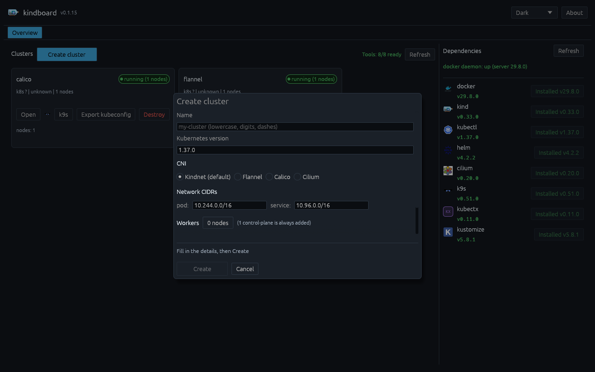
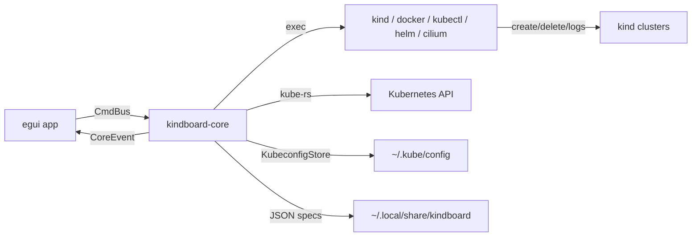

# kindboard

> Local Kubernetes-in-Docker clusters — with a real CNI, ingress, and observability —
> managed from a desktop app instead of a pile of shell scripts.

**Website:** <https://orpere.github.io/kindboard/> · **Repo:** <https://github.com/Orpere/kindboard> ·
**Download:** <https://github.com/Orpere/kindboard/releases/latest> (tarball + SHA256SUMS)

**kindboard** is an open-source desktop dashboard for creating and managing
[kind](https://kind.sigs.k8s.io) (Kubernetes-in-Docker) clusters on Linux and
macOS, built in Rust. It speaks to the same official tools you already trust —
kind, docker, kubectl, helm, and the Cilium CLI — and automates the parts kind
leaves to you: **flannel, calico or Cilium** networking, **nginx, traefik or
Cilium** ingress, Hubble observability, the Gateway API, and cluster mesh.


> by Orlando Rosa Pereira — [github.com/Orpere](https://github.com/Orpere)

---

## Why kindboard?

`kind create cluster` gives you a working Kubernetes in minutes — and then
stops. Beyond the default kindnet CNI, nothing is wired for you:

- kind ships no **CNI** beyond kindnet (flannel, calico and Cilium need their
  own install + pod-CIDR wiring — kindboard handles Cilium's kernel-7.2
  incompatibility and its strict values for you).
- It ships no **ingress controller** (nginx/traefik/Cilium all need manifests,
  helm repos, or `--set` flags you have to look up).
- It gives you **no observability** — no topology view, no log tailing, no
  Hubble — and, by design, **no way to scale or shrink a cluster** (kind has no
  node-level commands).

kindboard wraps the full lifecycle in one GUI and one plan engine: it boots
clusters, installs the CNI and ingress you picked, opens a live topology tab,
tails logs, exports kubeconfigs, and manages missing dependency tools — always
running the official binaries underneath, printing their output in kind's own
style, and persisting everything crash-safely.

## What kindboard does

- **Multiple clusters, each with its own settings** — name, Kubernetes
  version, CNI (kindnet default, flannel, calico, cilium), pod/service CIDR,
  feature gates, extra port mappings, worker count.
- **Cilium extras as checkboxes** — Gateway API, Hubble (relay + UI), Ingress
  Controller and Mesh (clustermesh); enabling Mesh opens a per-cluster ID form
  (cluster-id + cluster-name). Cilium replaces kube-proxy
  (`kubeProxyReplacement=true`), which its Gateway API controller requires.
- **Kernel-aware Cilium** — on Docker kernels ≥ 7.2, kindboard automatically
  installs the first Cilium release with the `bpf_set_retval` fix
  (v1.21.0-pre.2) instead of the broken stable; one `cilium install` carries
  all extras (Gateway API v1.6.2 CRDs applied first), so there are no
  post-install release upgrades (ADR-0014, ADR-0015).
- **Ingress controller of your choice** — nginx, traefik or cilium, with
  automatic host-port mapping (80/443).
- **A dependency manager built in** — detects and installs docker, kind,
  kubectl, helm, the Cilium CLI, k9s, kubectx and kustomize: package manager
  first (brew/dnf/apt/pacman), official binaries with **SHA-256 verification**
  as fallback — including the docker daemon state.
- **Kubeconfig lifecycle handled safely** — every cluster is added as a
  context on create and removed on destroy, verified and repaired even for
  clusters created outside the app (atomic writes, `.bak` on the previous
  file).
- **Per-cluster tabs with a live topology diagram** — namespaces, workloads,
  pods, services and ingresses as a layered graph with status colors,
  pan/zoom, click-to-inspect and opt-in auto-refresh.
- **Log watching** — node containers via `docker logs -f` and workload pods
  via `kubectl logs -f`, in bounded, follow-mode ring buffers (2,000 lines /
  256 KiB per source — a runaway stream can never grow memory without limit).
- **Full cluster management** — scale workers up and down, delete individual
  worker nodes, destroy with a type-the-name confirmation, and export
  logs/kubeconfig. Cluster creation output mirrors `kind create cluster`
  (`✓`/`✗` steps + `kubectl cluster-info --context kind-<name>` footer), so a
  failed step reads exactly like the official tool text.
- **k9s integration** — an **Open in k9s** button on every cluster card and
  tab launches k9s for that cluster in a new terminal.
- **Three professional themes** — Dark, Light and High Contrast, switchable
  from the top bar and persisted across restarts, all sharing the same card /
  stroke / status design language with contrast-checked text on every button
  and highlight.
- **Fits any window size** — every view adapts from 1280×800 down to 640×480:
  modals clamp and scroll, toolbars wrap, panels keep bounded widths, and the
  topology diagram starts centered and auto-fits the dashboard (re-fitting on
  resize until you pan or zoom manually).
- **Dependency readiness on the dashboard** — the Overview shows a live
  "Tools N/8" summary and surfaces missing critical tools (docker/kind) with a
  one-click install right from the dashboard.
- **Official tool logos** — the dependencies panel and buttons use the official
  project logos (kubectl uses the Kubernetes logo); tools without one
  (kubectx) get a monogram.

> **Scaling note:** kind fixes the node topology at creation time. kindboard
> implements "scale workers" / "delete node" as a one-click *guided recreate*
> that preserves all cluster settings, with an explicit workload-loss warning —
> the only safe way to resize a kind cluster (ADR-0002, verified against kind
> upstream).

## Quick start

**Prebuilt binary** — download `kindboard-<os>-<arch>.tar.gz` from the
[Releases](https://github.com/Orpere/kindboard/releases) page (or run
`scripts/build.sh` to produce `dist/` yourself), extract, run `./kindboard`.

macOS first run: darwin binaries are ad-hoc signed with a pure-Rust toolchain
(no Apple Developer ID). Gatekeeper may show "unidentified developer" —
right-click the binary → Open, or run `xattr -d com.apple.quarantine
./kindboard` once.

**From source** (Rust 1.98+):

```bash
make run        # run the app in debug mode
make build      # full gates + release artifacts in dist/ + SHA256SUMS
```

**Your first cluster takes three clicks:**

1. Open the **Overview** tab → **Create cluster**.
2. Name it, pick a Kubernetes version, and choose a CNI — flannel, calico,
   or cilium (with its extras; kindboard picks the kernel-compatible Cilium
   version automatically):

   

3. Hit **Create**. kindboard watches each provision step as it runs — kind
   create, kubeconfig merge, CNI install, readiness check — all in kind's own
   `✓`/`✗` style.

See [docs/howtos/create-cni-clusters.md](docs/howtos/create-cni-clusters.md)
for the full walkthrough, what each CNI install does under the hood, and known
environment limitations.

## Command line

`kindboard` is a desktop app; by default it runs in the foreground of the
terminal that launched it, so you can watch the logs live. Everything else is
opt-in:

| Flag | Effect |
|---|---|
| `--help`, `--version` | Usage / version (exits immediately) |
| `--detach` | Launch the GUI in the **background** (new session, stdio to `/dev/null`); the terminal prints the PID + log path and returns. Logs keep flowing to `<data_dir>/kindboard/kindboard.log` |
| `-v`, `--verbose` | Raise the log level — repeatable: `-v` → debug, `-vv` → trace. The quickest troubleshooting combo: `kindboard --detach -v --log-file ~/kindboard.log` |
| `--log-file <path>` | Also write timestamped log records to `<path>`; in `--detach` mode this defaults to `<data_dir>/kindboard/kindboard.log` |
| `--screenshot <file.png>` | Capture one screenshot then exit (CI / headless, e.g. on Xvfb) |
| `--screenshot-every <secs> [--screenshot-dir <dir>]` | Capture periodically into a directory, then exit |

Dev/CI environment knobs for the screenshot harness (headless documentation
captures):

| Variable | Effect |
|---|---|
| `KINDBOARD_WINDOW_SIZE=WxH` | Override the initial window size (e.g. `640x480` to verify small frames) |
| `KINDBOARD_OPEN_CLUSTER=<name>` | Auto-open a cluster tab once the first reconcile lands |
| `KINDBOARD_OPEN_WIZARD=1` | Open the create wizard on the first frame |
| `XDG_DATA_HOME=<dir>` | Point the state dir elsewhere; a `settings.json` with `{"theme":"light"}` renders that theme |

**Troubleshooting recipe:** run the app from a terminal without flags to see
all `warn`+ records on stderr; add `-v`/`-vv` for the full subprocess and
provisioning trace (exec args, provision steps, dependency installs, topology
watch errors). Detached runs always write to a log file, so
`tail -f ~/.local/share/kindboard/kindboard.log` works right after `--detach`.

## Make targets

| Target | Purpose |
|---|---|
| `make run` | Run the desktop app (debug) |
| `make check` | All quality gates: `fmt --check`, `clippy -D warnings`, tests |
| `make test` | Unit + integration tests (e2e skipped unless `KINDBOARD_E2E=1`) |
| `make e2e` | Full suite including real-kind e2e (requires docker + kind; throwaway `kbtest-*` clusters). Covers cluster create/delete, kubeconfig merge, topology, and the CNI matrix (flannel/calico/cilium full installs) |
| `make audit` | RustSec advisory scan (needs `cargo install cargo-audit`) |
| `make build` / `make dist` | Release build into `dist/` + `SHA256SUMS` (runs all gates first) |
| `make build-all` | Attempt all four targets: linux x86_64/aarch64, darwin x86_64/arm64. Runs `darwin-bootstrap` first, then on Linux hosts the darwin targets build via osxcross when it is present (see ADR-0017), else they are skipped with guidance |
| `make dist-macos` | Cross-build darwin release assets with `KINDBOARD_REQUIRE_DARWIN=1`; auto-resolves all darwin dependencies first via `make darwin-bootstrap`; binaries are ad-hoc signed via rcodesign |
| `make darwin-bootstrap` | Resolve all darwin (macOS) cross-build dependencies — host packages (sudo, confirm-first or `KINDBOARD_BOOTSTRAP_YES=1`), rustup targets, rcodesign, osxcross toolchain + digest-pinned SDK. Idempotent; `--check` mode via `./scripts/bootstrap-darwin.sh --check` |
| `make assets` | Fetch + resize the official logos into `assets/` (ImageMagick) |
| `make clean` | Remove build artifacts and `dist/` |
| `make help` | List all targets |

Scripts: `scripts/build.sh` (reproducible release pipeline) ·
`scripts/prepare-assets.sh` (logo pipeline). No GitHub Actions — builds are
local by design.

## How kindboard works

kindboard is two Rust crates with one hard seam (ADR-0008):

- **`kindboard-core`** — a UI-free library (`#![forbid(unsafe_code)]`) that
  owns everything risky: subprocess spawning, the tokio runtime, kube-rs, and
  all disk/kubeconfig writes. It exposes only typed `Command`s and `Event`s.
- **`kindboard-app`** — the eframe/egui desktop binary, which enqueues
  `Command`s and renders `Event`s. The UI can't crash your cluster, and the
  orchestration is fully testable headlessly.



Deep dives: [docs/architecture.md](docs/architecture.md) (design, async model,
failure modes) and [docs/contracts.md](docs/contracts.md) (the typed seams
between every module).

**Components** (official logos, see [assets/ATTRIBUTION.md](assets/ATTRIBUTION.md)):

| Core tooling | CNIs & ingress | Utilities |
|---|---|---|
|  kind ·  docker ·  kubectl ·  helm ·  cilium CLI |  flannel ·  calico ·  cilium ·  nginx ingress ·  traefik |  k9s ·  kubectx ·  kustomize |

## Documentation

| Doc | Contents |
|---|---|
| [docs/architecture.md](docs/architecture.md) | Why the app is shaped this way: design goals, system graph, async model, failure modes, verification logs |
| [docs/contracts.md](docs/contracts.md) | The typed contracts between modules: spec, commands, provisioning order, topology |
| [docs/dependency-install-matrix.md](docs/dependency-install-matrix.md) | Detection commands, package names, pinned binary downloads per tool |
| [docs/howtos/install-kubectx.md](docs/howtos/install-kubectx.md) | **How-to with screenshots:** install kubectx from the Dependencies panel |
| [docs/howtos/create-cni-clusters.md](docs/howtos/create-cni-clusters.md) | **How-to with screenshots:** flannel, calico and cilium clusters, end to end |
| [docs/adrs/](docs/adrs/) | Architecture decision records (ADR-0008 … 0016) |
| [assets/ATTRIBUTION.md](assets/ATTRIBUTION.md) | Logo ownership, sources and trademark notes |

## Website

A self-contained static website lives in [`web/`](web/) — pure HTML/CSS/JS with
no build step, no external assets, and relative paths only, so it can be
uploaded as-is to any server or domain. It presents the project, features,
architecture, CNI matrix and screenshots for people studying Kubernetes and
DevOps. Open `web/index.html` locally or serve the folder with any static
server. (The GitHub links in the header/footer are placeholders — point them
at your repository before publishing.)

## License & attribution

[MIT](LICENSE) © 2026 Orlando Rosa Pereira. Project logos belong to their
respective owners — see [assets/ATTRIBUTION.md](assets/ATTRIBUTION.md).