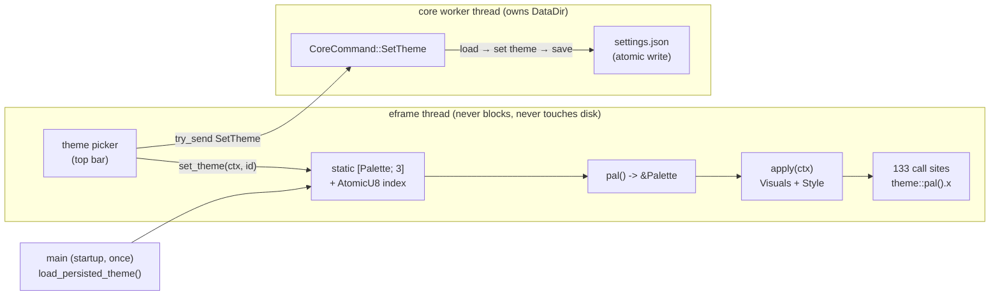

# ADR-0016 — Multi-theme palette registry + full viewport fit

- **Status:** Accepted
- **Date:** 2026-09-13

## Context

kindboard ships one hardcoded dark palette: `crates/kindboard-app/src/theme.rs`
defines the visual identity as `pub const Color32`s (`BG`, `ACCENT`, `GREEN`,
…) plus `apply(ctx)`, `card_frame()`, `canvas_frame()`, and `dim(color)`
(= `rgb/5`, dark-only semantics). **133 `theme::` call sites across 10 files**
reference those constants directly. Rust `const`s cannot be swapped at
runtime, so any theme feature requires an accessor refactor.

The user intent ("make multiplus themes … and the fit to the view have really
to fit to the view whatever is the size of the frame") decomposes into:

- **R1** multiple runtime-selectable themes,
- **R2** the same professional kindboard design language in every theme (only
  the palette changes — cards, strokes, status palette, accent, spacing stay),
- **R3** every view fits any window size (no clipped content, no overflow),
- **R4** tests + screenshots at several window sizes and themes.

Recon (PLAN.md §9.2) also established: several *fixed* widths break small
frames (wizard modal `set_width(520)`, destroy modal `400`, scale modal `330`,
tab-confirm modal `430`, overview cards `330`, deps right panel `default_size
(380)`); the window min is `960x600` (main.rs:419-420); and `Settings` exists
in core (`state/mod.rs:267`, `#[serde(flatten)] other`) but **the app crate
never loads or saves it today** — the worker owns `DataDir` and all file I/O.

## Decision

### 1. Theme set (R1)

Three themes, stable string ids for persistence:

| `ThemeId` | id (settings.json) | label | base visuals |
|---|---|---|---|
| `Dark` | `"dark"` | `Dark` | `Visuals::dark()` — the current palette, unchanged |
| `Light` | `"light"` | `Light` | `Visuals::light()` |
| `HighContrast` | `"high-contrast"` | `High Contrast` | `Visuals::light()` + max-contrast strokes |

### 2. Dynamic palette access pattern (R2)

The 12 palette `const`s become **fields of a `Palette` struct**; three
`const`-constructed `Palette` instances live in a `static [Palette; 3]`, and
the *active* palette is an `AtomicU8` index into that array. All call sites go
through `theme::pal()` (returns `&'static Palette`). `apply(ctx)` reads
`pal()`; `set_theme(ctx, id)` swaps the index and re-applies visuals/style.

Rationale (see full comparison under *Alternatives*):

- **Smallest, safest diff**: every `theme::X` becomes `theme::pal().x` — a
  mechanical, type-preserving rename (a `Color32` stays a `Color32`; the three
  `theme::ACCENT.r()/.g()/.b()` channel reads at diagram.rs:345-347 keep
  working because `pal().accent` is still a `Color32`). No view signature
  changes, no lifetime plumbing.
- **Zero lock, zero allocation, unpoisonable**: `AtomicU8` + `static` array
  beats `RwLock<Palette>`/`OnceLock` (no poisoning path, no `.read()` unwrap,
  no allocation on the hot per-frame path).
- **`const`-constructible**: `Color32::from_rgb` is a `const fn` (already used
  by the current `const`s), so the three palettes are compile-time data.

### 3. `dim()` becomes per-theme

`dim(color)` is currently `rgb/5` — correct only on dark surfaces. It becomes
`Palette::dim(&self, color) -> Color32` with per-theme semantics:

- `Dark` — `c/5` byte-wise (exact current behavior, regression requirement).
- `Light` — lighten toward white: `c + (255-c)*0.80` (a pale tint of the hue).
- `HighContrast` — `c/2` byte-wise (half-brightness hue; visible on black with
  the 1px white stroke).

The mechanical rename is `theme::dim(x)` → `theme::pal().dim(x)`; nested calls
(`theme::dim(theme::RED)`) become `theme::pal().dim(theme::pal().red)`.

### 4. Per-theme Visuals/Style derivation

`apply(ctx)` keeps its name/signature. Internally it becomes
`apply_theme(ctx, current())` which:

- starts from `Visuals::dark()` (Dark) or `Visuals::light()` (Light/HighContrast),
- overrides `panel_fill`, `window_fill`, `window_stroke`, `selection`,
  `hyperlink_color`, the `widgets.{noninteractive,inactive,hovered,active}`
  bg/stroke fields, and `extreme_bg_color` from `pal()`,
- applies the **same `Style`** (item_spacing 8×8, button_padding 10×5,
  interact_size.y 26, window_margin 14, solid scroll) in every theme — this is
  what keeps R2 ("same design language") while only the palette changes.

`card_frame()`/`canvas_frame()` had zero call sites and were **removed**
during implementation (cleanup directive: no dead code) — see the §7
amendments in `docs/theme-contract.md`.

### 5. Persistence wiring (worker owns the disk)

`Settings` gains `pub theme: Option<String>` with
`#[serde(default, skip_serializing_if = "Option::is_none")]` — an old
`settings.json` without the field deserializes to `None` (default Dark), and an
unknown key still flows into the `#[serde(flatten)] other` map. The app keeps
**never touching disk and never blocking**:

- **Load at startup** (synchronous, before the window exists, so no flash):
  `theme::load_persisted_theme() -> ThemeId` reads
  `DataDir::standard()?.load_settings()?.theme`, maps through
  `ThemeId::from_id`, falls back to `Dark`; `main` passes it into
  `KindboardApp::new(…, initial_theme)`.
- **Save on switch** (asynchronous, via the existing bus): a new
  `CoreCommand::SetTheme { id: String }`; the worker does
  `load_settings → set theme → save_settings` (atomic write already in core)
  and emits `CoreEvent::Notice` on failure. The UI thread only `try_send`s.

### 6. Theme switcher UI

A compact `ComboBox` in the **top bar's right-to-left cluster** (before the
existing `About` button), listing the three labels; on selection it calls
`theme::set_theme(ctx, id)` then `issue(CoreCommand::SetTheme { .. })`.

### 7. Responsive strategy + minimum size (R3)

New minimum window size: **640×480** (was 960×600). See `docs/theme-contract.md`
§4 for the exact per-view mechanism; the headline rules are: clamp every
`set_width`/`desired_width` to `ui.available_width()`, make every multi-button
toolbar `horizontal_wrapped` (or a horizontal `ScrollArea` for the tab bar),
give every resizable `Panel` explicit `min_size`/`max_size`, and make every
modal scrollable. The full implementer contract is
[`docs/theme-contract.md`](../theme-contract.md).

### System graph

Failure boundary: the registry is read-only per frame (`AtomicU8`, no lock, no
allocation, cannot poison). The only fallible side is persistence — a save
failure surfaces as a `CoreEvent::Notice` banner and never affects the active
in-memory theme. A corrupt/missing `settings.json` falls back to `Dark` at
startup.

## Alternatives considered

- **Pass `&Theme`/`&Palette` down every view** — correct but touches every
  `show()` signature and ~133 call sites with a new parameter; highest churn
  and borrow-checker friction for zero benefit over a global. Rejected.
- **`RwLock<Palette>`/`OnceLock` global** — works, but a `RwLock` on the
  per-frame hot path adds a poisonable lock; `OnceLock` needs an allocation and
  an unwrap. `AtomicU8` + `const` array is strictly simpler. Rejected.
- **Drive everything through egui `Visuals`/`Style` only** — Visuals has no
  notion of status colors, canvas bg, or `dim`; call sites would still need
  explicit colors, so we'd keep a palette anyway. Rejected (adopted as the
  *base* but not the whole story).
- **Keep `dim` as a free `fn` and special-case light themes at call sites** —
  scatters theme logic into 6 call sites and risks silent dark-on-light
  mistakes. Rejected in favor of `Palette::dim`.
- **Persist theme from the UI thread directly** — the app has no `DataDir`
  (the worker owns it per architecture §5) and would duplicate path
  resolution; a blocking `save` would violate the never-block rule. Rejected
  in favor of the worker command.
- **Emit `SettingsLoaded` and let the worker own startup too** — correct but
  causes a one-frame flash of the default theme for light-theme users; the
  one-time synchronous read in `main` (before the window exists) avoids it
  without ever blocking the UI thread. Rejected as the primary path.

## Consequences

- 135 `theme::` symbol references (across 133 lines / 10 files) get a
  mechanical rename; the exact list + counts are in
  `docs/theme-contract.md` §3.
- Light/High-Contrast expose a few *inline* hardcoded colors that were fine on
  dark only (diagram node text `0xd6e4ee`, tooltip black-alpha, service/ingress
  tint fills, `Succeeded` blue `0x4f9dc9`). These are promoted to `Palette`
  fields so a light theme doesn't render near-white text on a light canvas
  (see contract §2 "recommended fields" and §5 "risks").
- `Settings.theme` is additive and backward compatible; a file written by an
  older build still loads, and a newer file still round-trips through `other`.
- The min size drop to 640×480 requires every view to be re-verified at that
  size (screenshot harness already exists: `--screenshot`/`--screenshot-every`).

## Verification

- Baseline (unmodified tree) is green before implementation starts:
  `cargo fmt --check` = 0, `cargo clippy --all-targets -- -D warnings` = 0,
  `cargo test --workspace` = pass.
- Contract checks in `docs/theme-contract.md` §6: unit tests for
  `ThemeId::from_id` (case-insensitive, unknown → `None`), `dim()` per-theme
  (Dark `/5`, Light lighten k=0.80, HighContrast `/2`), `Palette` field
  completeness (every `theme::` symbol today maps to a field), and a
  `Settings` round-trip test (old JSON without `theme` loads; new JSON
  round-trips without losing `other` keys).
- Screenshot matrix (R4): all three themes × {1280×800, 960×600, 640×480} via
  the headless harness; no clipped content, no horizontal scrollbars in any
  theme/size.

## Amendment (R9) — topology diagram auto-fit

During QA the requirement "the topology graph starts centered and fits the
dashboard" was added. Implemented in `views/diagram.rs`: `DiagramState`
tracks `last_canvas` and `user_taken_over`; `should_auto_fit()` fits on the
first real snapshot, survives degenerate early canvases (async WM sizing),
and re-fits on window resize — until the user pans or zooms manually
(`request_fit()` on the "Fit to view" button resumes auto mode). Covered by
unit tests (`auto_fit_starts_centered_and_tracks_canvas`,
`request_fit_resumes_auto_mode`).
