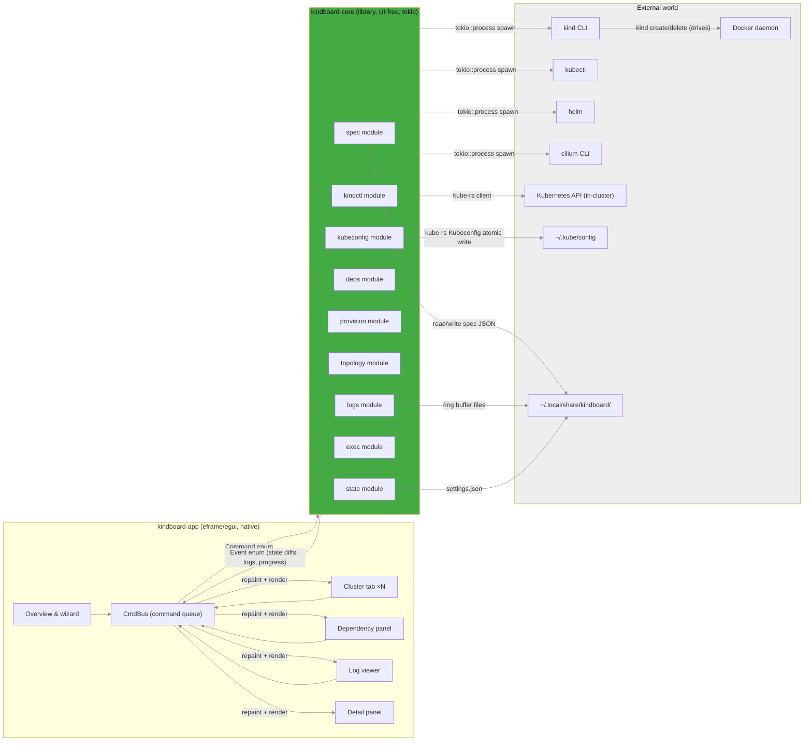
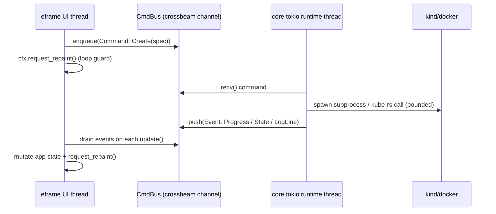

# kindboard — Architecture

> Design record for `kindboard-core` + `kindboard-app`. Companion documents:
> `docs/contracts.md` (typed seams), `docs/adrs/ADR-0008…0015` (decisions),
> `docs/dependency-install-matrix.md` (tool installs).
>
> All flag names, field names, and URLs below were verified against official
> docs/source on 2026-09-12, and the provisioning paths were exercised live on
> 2026-09-13 — see [§8](#8-verification-log-2026-09-12) and
> [§9](#9-live-e2e-verification-2026-09-13).

## 1. Design goals & guiding principles

kindboard exists because "kind cluster up" is not "kind cluster done". The
architecture is the answer to five constraints, in priority order:

1. **The risky code must be testable without a GUI.** Every subprocess call,
   kubeconfig edit, and disk write lives in `kindboard-core`, a
   `#![forbid(unsafe_code)]` library with zero egui/eframe dependencies
   (ADR-0008). The desktop app is a thin command/event relay. A bug in a
   button's click handler can never corrupt a cluster or a kubeconfig.
2. **Boring, proven tools only.** No custom CNI logic — kindboard drives the
   exact binaries a human would: `kind`, `kubectl`, `helm`, the `cilium` CLI.
   No shell interpolation (ADR-0009): every invocation is an args array, so
   there is no quoting-injection class of bug.
3. **The real world wins over assumptions.** kind has no node add/remove
   commands, so scaling is an explicit guided recreate (ADR-0002). Cilium's
   Gateway API controller requires kube-proxy replacement, so Cilium clusters
   render kind `networking.kubeProxyMode: none` and install with
   `kubeProxyReplacement=true` ([§9](#9-live-e2e-verification-2026-09-13),
   ADR-0015). Facts are verified against the tools themselves and recorded
   ([§8](#8-verification-log-2026-09-12)).
4. **Fail loud, fail typed.** Every failure is a typed error
   ([§5](#5-error-taxonomy-thiserror)); cancellation, timeouts, and drift are
   first-class conditions, never silent swallows.
5. **Reproducible by default.** Downloads are tag-pinned AND SHA-256-checked;
   releases are built by a local script into `dist/` with checksums
   (ADR-0004) — no build that depends on the state of someone's CI fleet.

## 2. System graph



**Failure boundaries (drawn on the graph):**

- `kindboard-core` is the *only* component that spawns processes or touches the
  network, kubeconfig, or disk. It must never panic on bad subprocess output —
  every call returns a typed `Error` ([§5](#5-error-taxonomy-thiserror)).
- `kindboard-app` never talks to Docker/kubectl/k8s directly. It only enqueues
  `Command`s and renders `Event`s — so the blast radius of a UI bug is zero
  outside the process.
- `CmdBus` is the single seam between UI and core — and therefore the single
  place to inject fakes in tests.
- Kubeconfig writes are isolated to the `kubecfg` module and always go through
  atomic write + `.bak` (ADR-0007): a crash mid-write cannot corrupt
  `~/.kube/config`.
- Log ring buffers are isolated per-cluster files; a runaway log stream is
  bounded by ring capacity (ADR-0012), never by UI memory.

## 3. Crate & module layout

Two crates, one seam (ADR-0001, ADR-0008). Core is the universe of risk; the
app is its remote control.

### 3.1 `kindboard-core` (library — UI-free, `#![forbid(unsafe_code)]`)

Every module is `pub` to `kindboard-app`; no module imports `eframe`/`egui`.
The tokio runtime is *owned by core* ([§4](#4-async-model)).

| Module | Responsibility | Key public types (see contracts.md) |
|---|---|---|
| `spec` | `ClusterSpec` + CNI/ingress/cilium enums; validation; (de)serialization; spec→kind-config generation | `ClusterSpec`, `Cni`, `IngressController`, `CiliumOptions`, `KindConfig` |
| `exec` | `tokio::process` wrapper: args-only spawn, cancellation, streaming stdout/stderr, timeouts, env (ADR-0009) | `Cmd`, `CmdOutput`, `ProcessHandle` |
| `kindctl` | Every kind/docker/kubectl/helm/cilium invocation as a typed enum; list/adopt clusters; version detection | `KindCommand` |
| `provision` | Create/destroy flow, CNI/ingress/cilium install, scale=recreate (ADR-0002), provisioning order matrix, kernel-aware Cilium version selection (ADR-0014), kube-proxy replacement + Gateway API CRD ordering (ADR-0015) | `CreatePlan`, `ProvisionStep` |
| `kubeconfig` | Merge/remove contexts via `kube::config::Kubeconfig` + atomic write + `.bak`; adopt-verification (ADR-0007) | `KubeconfigStore` |
| `deps` | Detect/install dependency tools; registry of recipes (ADR-0003) | `Tool`, `ToolStatus`, `InstallRecipe` |
| `topology` | Poll/watch k8s API into a typed topology model; layered-DAG layout (ADR-0010/0011) | `TopologyGraph`, `Workload`, `Pod`, … |
| `logs` | Bounded ring buffers, follow mode, source selection docker vs kubectl (ADR-0012) | `LogRing`, `LogSource` |
| `state` | Persistence dir layout, settings, per-cluster spec store, crash-safe JSON writes | `DataDir`, `Settings` |

### 3.2 `kindboard-app` (eframe binary — thin, all logic in core)

| Module | Responsibility |
|---|---|
| `main.rs` | Build `eframe::NativeOptions`, spawn core runtime thread, start `eframe::run_native`; CLI flags (`--detach`/`-v`/`--log-file`, ADR-0013) |
| `app.rs` | `KindboardApp: eframe::App` — holds `CmdBus`, renders tab bar + active view |
| `bus.rs` | `CmdBus` (command queue) + `EventBus` (event stream into egui) |
| `views/overview.rs` | Cluster list + create wizard |
| `views/cluster.rs` | Per-cluster tab: topology diagram, node list, detail panel |
| `views/deps.rs` | Dependency panel |
| `views/logs.rs` | Log viewer |
| `diagram.rs` | egui painter for the topology DAG (consumes `TopologyGraph` layout from core) |

No new crates beyond `kindboard-core` + `kindboard-app`. Optionally, dev-only
integration tests live in `tests/` inside core.

## 4. Async model



Decisions:

- **One dedicated tokio runtime on a background `std::thread`** (multi-thread
  runtime, N=2..4 workers). The egui UI thread stays synchronous and never
  blocks on I/O. Core exposes `core::run(CmdReceiver, EventSender,
  shutdown_rx)`.
- **Channels are `crossbeam_channel`** (MPSC for commands, MPMC for events),
  not `tokio::mpsc`, so the UI thread can push/pull without an async context.
  Events are `Arc`-ed or small owned enums to avoid cloning large payloads.
- **Repaint strategy:** egui is immediate-mode; the UI calls
  `ctx.request_repaint()` only when an `Event` arrives. Between events the UI
  thread sleeps on the channel (`recv_timeout`) with a short tick (~100 ms) as
  a safety net for progress bars. No continuous 60 fps repaint loop — YAGNI.
- **Cancellation is cooperative:** every core operation owns a
  `tokio::sync::watch`/`CancellationToken`; the UI can enqueue
  `Command::Cancel(id)`. Subprocesses get `SIGTERM`, then `SIGKILL` after a
  grace window (ADR-0009), and cancellation is *classified* correctly — a
  shell that exits 0 after a group SIGTERM still reports `Cancelled`, not
  success (TRACE-001).
- **The long-running topology watch** runs as one background task per cluster
  using `kube::runtime::watcher` (ADR-0010/0011), emitting
  `Event::Topology(changed_subgraph)` diffs; errors back off and surface as a
  stale-data banner rather than a dead tab.

## 5. Error taxonomy (`thiserror`)

A single enum tree rooted at `kindboard_core::Error`. The UI maps it to a
human string; no `unwrap()` crosses the core boundary.

```rust
#[derive(Debug, thiserror::Error)]
pub enum Error {
    #[error("subprocess `{prog}` exited with {code}: {stderr_tail}")]
    Command { prog: String, code: Option<i32>, stderr_tail: String },
    #[error("command timed out after {elapsed:?}: {prog}")]
    Timeout { prog: String, elapsed: Duration },
    #[error("cancelled")]
    Cancelled,

    #[error("dependency missing: {0}")]
    MissingTool(Tool),
    #[error("dependency install failed for {tool}: {reason}")]
    InstallFailed { tool: Tool, reason: String },

    #[error("kubeconfig error: {0}")]
    Kubeconfig(#[from] kube::config::KubeconfigError),
    #[error("kubernetes API error: {0}")]
    Kube(#[from] kube::Error),
    #[error("serialization error: {0}")]
    Serde(#[from] serde_json::Error),

    #[error("invalid cluster spec: {0}")]
    InvalidSpec(String),
    #[error("cluster already exists: {0}")]
    ClusterExists(String),
    #[error("cluster not found: {0}")]
    ClusterNotFound(String),
    #[error("state drift detected for {0}: {1}")]
    Drift { cluster: String, detail: String },

    #[error("io error at {path}: {source}")]
    Io { path: PathBuf, #[source] source: std::io::Error },
    #[error("{0}")]
    Other(String),
}
```

Rules: `Command`/`Timeout`/`Cancelled` cover all subprocess failures with a
bounded `stderr_tail` (last 2 KiB). `Kube`/`Kubeconfig`/`Serde` are
transparent `#[from]` conversions. Every variant is UI-friendly and never
exposes secrets (kubeconfig tokens, cluster passwords — house rule from the
2026-09-12 security audit).

## 6. Persistence layout

Root: `~/.local/share/kindboard/` on Linux (`XDG_DATA_HOME` if set),
`~/Library/Application Support/kindboard/` on macOS (`dirs` crate) — the same
root used for detached-mode log files (ADR-0013).

```
kindboard/
├── settings.json                 # window state, preferred CNI/ingress defaults, poll interval
├── clusters/
│   └── <name>.json               # ClusterSpec as-created (source of truth for recreate) — ADR-0006
├── logs/
│   └── <name>/<source>.ring      # bounded ring buffer, one per (cluster, log source) — ADR-0012
└── tmp/                           # staging for atomic writes; cleaned on start
```

Writes are **atomic everywhere**: serialize to `tmp/`, `fsync`, rename over
target; keep `.bak` for the previous kubeconfig only (ADR-0007). Spec JSON
files are small and written once on create + on spec edits; a failed recreate
never mutates the stored spec until the new cluster is up.

## 7. Failure-mode table

| Failure | Detection | Handling strategy |
|---|---|---|
| Subprocess non-zero exit | exit code != 0 | `Error::Command` (bounded stderr tail); UI shows + retry button |
| Subprocess hang | per-call timeout | TERM → 5 s grace → KILL → `Error::Timeout` |
| User cancels a create/recreate | `Command::Cancel` | cooperative cancel, same TERM→KILL ladder → `Error::Cancelled`; stored spec untouched |
| `kind create` on existing cluster | `kind get clusters` pre-check | `Error::ClusterExists`, skip |
| CNI/ingress install fails mid-flow | step verification fails | roll forward: re-run the idempotent step (helm `upgrade --install`); the cilium flow is a single `cilium install` carrying all values — no post-install release upgrades (ADR-0015); on repeated failure, surface `Error::Command` + offer "destroy cluster" |
| kubeconfig write interrupted | atomic write + `.bak` | previous file intact; repair on next start (ADR-0007) |
| Cluster deleted outside app | reconciliation tick (`kind get clusters`) | classify `Missing`; offer recreate from spec, never auto-recreate (ADR-0011) |
| Drift (worker count/version changed externally) | live props vs stored spec | `Error::Drift` surfaced; user-confirmed reconcile |
| Bad user input (CIDR, name, ports) | `spec::validate` before any command | `Error::InvalidSpec`, fail fast, no side effects |
| Docker daemon down | `docker info` at start + before create | block create; dependency panel shows daemon state |
| k8s API unavailable mid-watch | kube-rs `watcher` error | backoff re-watch (bounded), show stale-data banner, keep last-good graph |
| Log stream runaway | ring buffer cap + backpressure | evict oldest; cancel on tab close (ADR-0012) |

## 8. Verification log (2026-09-12)

Design-time facts, checked against the tools' own source and release pages
rather than assumed:

- `kind --help` surface: `build/create/delete/export/get/load/version` only —
  no node add/remove (confirms ADR-0002).
- kind v1alpha4 field names from `pkg/apis/config/v1alpha4/types.go` (main).
- kind default node image `kindest/node:v1.37.0` from `defaults/image.go`.
- cilium CLI flag set from `cilium-cli` `cli/install.go`, `cli/hubble.go`,
  `cli/clustermesh.go` (vendored, main).
- cilium 1.20.1 docs: clustermesh `setup.rst`, ingress, gateway-api
  `installation.rst`.
- calico v3.32.0 manifests (operator + custom-resources + classic) return
  HTTP 200; flannel `kube-flannel.yml` (v0.28.9) + ingress-nginx
  `controller-v1.12.1` kind `deploy.yaml` return HTTP 200.
- SHA-256 digests for all downloaded binaries/manifests transcribed from
  upstream `.sha256sum`/`checksums.txt` assets and verified against a fresh
  download (security audit 2026-09-12).
- helm 4.2.2 local `helm install --help`: `--wait` strategy default
  `hookOnly`.
- kube-rs 4.2.0 `Kubeconfig` methods (`read_from/from_yaml/read/from_env/
  merge`, `Serialize/Deserialize` with flatten `other`) from
  `kube-client/src/config/file_config.rs`.
- Fedora 44 `dnf repoquery` for package availability (see
  dependency-install-matrix).

## 9. Live e2e verification (2026-09-13)

Runtime facts, produced by exercising real kind clusters — not mocked:

- The CNI matrix e2e
  (`e2e_cni_matrix_flannel_calico_cilium`) ran live against real kind:
  **flannel ✓**, **calico ✓** and **cilium ✓** provisioned end to end (kind
  create → kubeconfig merge → CNI install → readiness verification → kube-rs
  topology read), clusters kept for inspection (`KINDBOARD_E2E_KEEP=1`).
- Fixes found and verified live along the way:
  - **calico:** the tigera operator registers its CRDs at runtime — the
    `Installation` CR now waits for `installations.operator.tigera.io` to
    exist (polling step, 5 min budget) before applying.
  - **exec timeouts:** `kubectl wait` steps now carry a 180 s runner budget
    (their internal `--timeout=2m` used to outlive the runner's 60 s) and
    install-class commands (helm/cilium) 600 s.
  - **cilium:** Cilium 1.20+ accepts only `true`/`false` for
    `kubeProxyReplacement` (the old `disabled` keyword is rejected); since
    round 2 the value is `true` with kind's kube-proxy disabled (ADR-0015).
- **Regression note (v0.1.0 → v0.1.1):** the initial release binary shipped
  `--set kubeProxyReplacement=disabled`, which Cilium 1.20's chart rejects
  with *"kubeProxyReplacement must be explicitly set to a valid value (true
  or false)"* — reproduced live on 2026-09-13 (`cilium install` fails at the
  configmap render before any agent starts). The fix landed in commit 48fd524
  and the release tarball was rebuilt as v0.1.1; re-download or rebuild from
  `main` if `--version` prints 0.1.0. Round 2 (ADR-0015) then moved the value
  to `true` alongside kind's `kubeProxyMode: none` — that is the current
  configuration.
- **cilium on kernel ≥ 7.2 now provisions green (ADR-0014):** kernel 7.2
  rejects cilium's unconditional `bpf_set_retval` helper probe (`call
  bpf_set_retval#187: R1 is not a scalar`; upstream issue cilium#48016), and
  every stable release as of 2026-09-13 (v1.18.13/v1.19.7/v1.20.1, all
  published 2026-08-18) predates the fix. kindboard probes the Docker host
  kernel (`docker info --format '{{.KernelVersion}}'`) and, for
  `(major, minor) >= (7, 2)`, passes `--version v1.21.0-pre.2` — the first
  release containing fix commit `67c619cb` — to the single cilium install.
  Live on kernel 7.2.4: Cilium/Operator/Envoy OK, Hubble relay+UI Running,
  Gateway API and ingress controller enabled, clustermesh-apiserver 3/3
  Running, `cilium status` exit 0.
- **Cilium is installed once with all values (ADR-0015):** Cilium's operator
  reads its config and discovers the Gateway API CRDs once at startup; a
  post-install `cilium upgrade` updates the configmap but does not roll the
  operator. The plan therefore applies the Gateway API **v1.6.2** CRDs before
  the single `cilium install`, which carries `kubeProxyReplacement=true`,
  ingress, Gateway API and clustermesh values. Cilium's Gateway API controller
  is disabled unless kube-proxy replacement is on
  (`operator/pkg/gateway-api/cell.go`); the previous pin (Gateway API v1.4.0)
  also shipped `tlsroutes`/`referencegrants` only at v1alpha3/v1beta1, while
  Cilium ≥ 1.21's operator requires both at v1. Verified live: operator starts
  with `enable-gateway-api=true` / `kube-proxy-replacement=true`;
  `GatewayClass` `Accepted=True`; a test `HTTPRoute` `Accepted=True`; DNS
  (`nslookup kubernetes.default`) resolves; `cilium status` OK for
  Cilium/Operator/Envoy/Hubble/ClusterMesh. No post-install release upgrades
  remain, so the `release name check failed: cannot reuse a name that is
  still in use` failure mode is gone.
- **Kind has no cloud LoadBalancer:** the Gateway API controller is fully
  functional, but a user-created `Gateway`'s service stays
  `EXTERNAL-IP: <pending>` until NodePort/hostNetwork or a
  `CiliumGatewayClassConfig` is configured — a documented kind caveat, not a
  provisioning failure.
- **Clustermesh on kind passes `--service-type NodePort`:** the CLI cannot
  auto-detect a service type on kind (`cannot auto-detect service type, please
  specify using '--service-type' option`); the flag matches the Helm value
  `clustermesh.apiserver.service.type=NodePort` the plan already sets.
- **Diagnosis retained as fallback:** if a cilium step still fails, kindboard
  inspects the agent pods (`kubectl get pods -l k8s-app=cilium` + `kubectl
  logs --tail=200`) and, on the `failed to probe helper` +
  `FnSetRetval`/`bpf_set_retval` signature, appends remedies — check `docker
  info --format '{{.KernelVersion}}'`, boot an older kernel, or use
  flannel/calico. The e2e keeps `KINDBOARD_E2E_SKIP_CILIUM=1` as an escape
  hatch for hosts where cilium cannot run.
- **Host requirement:** kind nodes consume inotify instances —
  `fs.inotify.max_user_instances=1024` and
  `fs.inotify.max_user_watches=524288` are set persistently in
  `/etc/sysctl.d/60-kindboard-inotify.conf` (a third kind node fails to
  bootstrap at the default 128 instances).
- **Screenshot capture** is built into the app (`--screenshot`,
  `--screenshot-every`, `--screenshot-delay`, `--screenshot-dir`) and used to
  produce the howto screenshots headlessly on Xvfb.