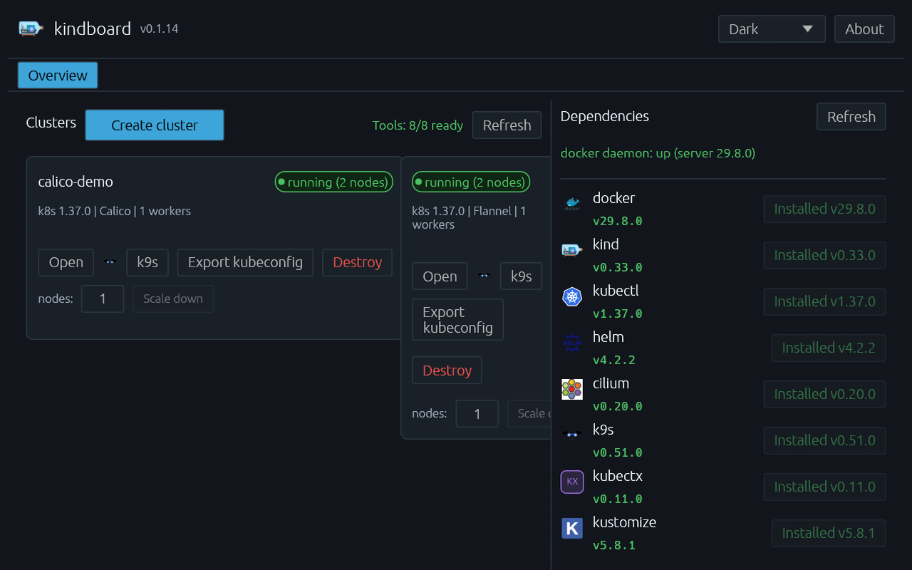
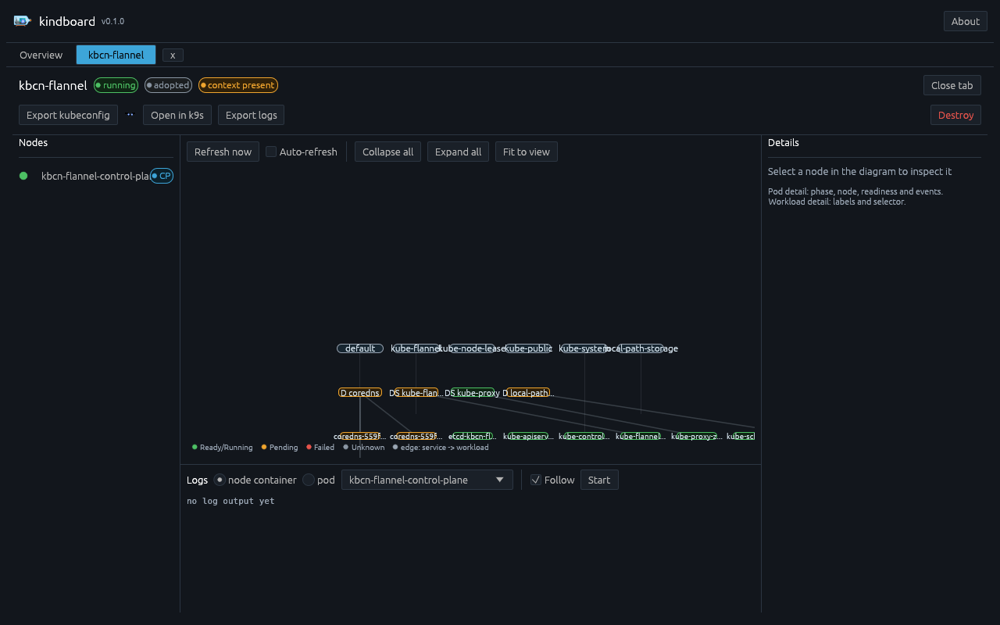
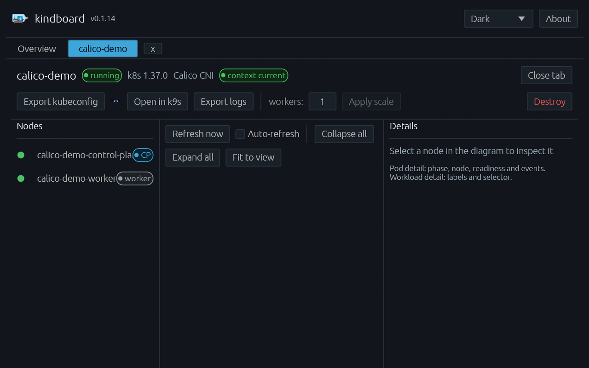
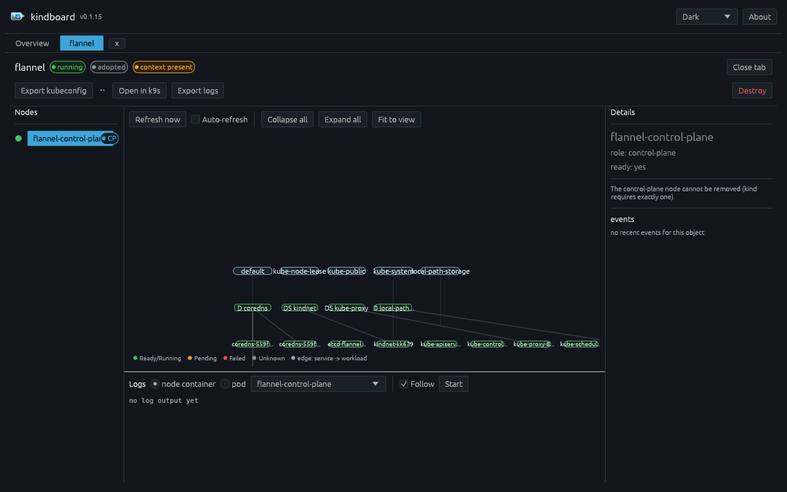

# How to create clusters with flannel, calico or cilium

Kind clusters are born with kindnet — kind's built-in, minimal CNI. If you
want the networking features the ecosystem actually runs on (NetworkPolicy,
encryption, eBPF service handling), you swap in a real CNI: this guide shows
all three, which kindboard installs for you automatically.

**Prerequisites:** Docker running, kind + kubectl installed (kindboard can
install those from the Dependencies panel — see
[install-kubectx.md](install-kubectx.md)). Time: ~5 minutes per cluster.

---

## 1. Open the create wizard

In the **Overview** tab, click **Create cluster**. Set a name, pick a
Kubernetes version, and choose the CNI:


The **Cilium extras** section appears only for cilium:

| Option | What it does |
|---|---|
| Gateway API | Installs the Gateway API CRDs and enables Cilium's Gateway API controller |
| Hubble | Enables Hubble observability (UI + relay) |
| Ingress controller | Installs Cilium's built-in ingress controller — **enabled by default** (the default ingress when none is chosen) |
| Mesh (clustermesh) | Adds a per-cluster cluster-id/cluster-name pair |

## 2. What kindboard does per CNI

Each CNI install follows the same shape — download a pinned manifest, apply
it, verify nodes become Ready — with CNI-specific details:

| CNI | Provisioning steps |
|---|---|
| **flannel** | Downloads `kube-flannel.yml` (release v0.28.9, SHA-256 pinned) → `kubectl apply` → waits for nodes Ready. The pod CIDR is patched into `net-conf.json.Network` when it differs from flannel's default `10.244.0.0/16`. |
| **calico** | Downloads the tigera operator manifest (v3.32.0, pinned) → `kubectl apply` → **waits for the operator's CRDs to become established** (the operator registers them at runtime; applying too early fails with "no matches for kind Installation") → applies the `Installation` custom resource (with your pod CIDR) → waits for nodes Ready. |
| **cilium** | Runs `cilium install --set kubeProxyReplacement=false` (via the official cilium CLI; Cilium 1.20+ accepts only `true`/`false` — the old `disabled` keyword is rejected) → verifies with `cilium status --wait` → then applies the enabled extras: Gateway API CRDs + `gatewayAPI.enabled=true`, Hubble relay + UI, `ingressController.enabled=true` (on by default) and clustermesh. |

Everything downloads over HTTPS with a pinned SHA-256; a digest mismatch
aborts the step before anything is executed.

## 3. Result — live clusters, live details

After provisioning, the Overview shows all clusters (including adopted
ones — any kind cluster on the system) with their live state, a per-cluster
node-count control (scale up/down), an **Open in k9s** button, and a guided
destroy. Every cluster opens a tab with the node list, a live topology
diagram (auto-centred), an inspectable detail panel and a log viewer:







Clicking a node shows its role and readiness. Worker nodes offer a
**Delete node** action (a guided, type-the-name-confirmed recreate with one
fewer worker — kind has no node-level removal); the control-plane node
cannot be removed:



## 4. Verified by the test suite

The CNI paths are covered by an end-to-end test
(`e2e_cni_matrix_flannel_calico_cilium`, gated by `KINDBOARD_E2E=1`) that
creates one cluster per CNI, runs the **full** provision plan including CNI
install and readiness verification, then confirms each cluster live: kind
lists it, the merged kubeconfig context exists, and a kube-rs topology read
returns ready nodes. The cilium leg enables the complete cilium stack
(Gateway API + Hubble + ingress controller + clustermesh).

```bash
# Run the full matrix (requires docker + kind + kubectl):
KINDBOARD_E2E=1 cargo test -p kindboard-core --test e2e \
  e2e_cni_matrix_flannel_calico_cilium -- --nocapture

# Same, but keep the clusters running afterwards (names kbcn-*):
KINDBOARD_E2E=1 KINDBOARD_E2E_KEEP=1 cargo test -p kindboard-core --test e2e \
  e2e_cni_matrix_flannel_calico_cilium -- --nocapture
```

Latest live runs (2026-09-13): flannel ✓ · calico ✓ · cilium — see below.

## 5. Known environment limitations

**cilium on kernel 7.x** — on hosts running kernel 7.x (e.g. Fedora 44's
7.2.4), the cilium agent crash-loops at startup with:

```
level=fatal msg="failed to probe helper" ... error="detect support for
FnSetRetval for program type CGroupSock: load program: invalid argument:
0: (85) call bpf_set_retval#187: R1 is not a scalar" progType=CGroupSock
helper=FnSetRetval
```

Kernel 7.x changed the `bpf_set_retval` BPF helper signature; cilium
1.20.1 and 1.21.0-pre.0 (current at the time of writing) still probe the
old form and refuse to start. This is an **upstream cilium ↔ kernel**
incompatibility, not a kindboard bug — kindboard's provisioning itself is
verified up to this point (kind-create ✓, `kubeProxyReplacement=false`
accepted ✓; the agent is the first thing that fails). If you hit it:

- boot an older kernel from the boot menu if one is installed (e.g.
  `6.19.10-300.fc44`), or
- skip the cilium leg on affected hosts: `KINDBOARD_E2E_SKIP_CILIUM=1`.

## Cleanup

```bash
kind delete cluster --name kbcn-flannel
kind delete cluster --name kbcn-calico
kind delete cluster --name kbcn-cilium
```

(or use the Destroy button on each cluster tab in kindboard.)
