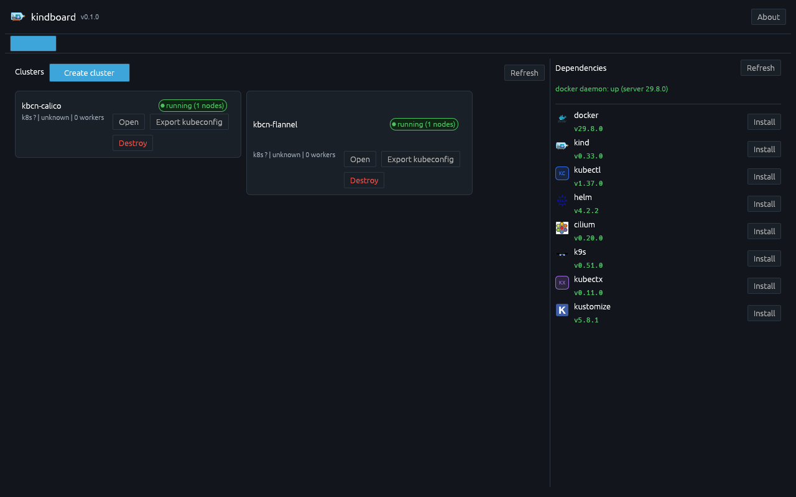
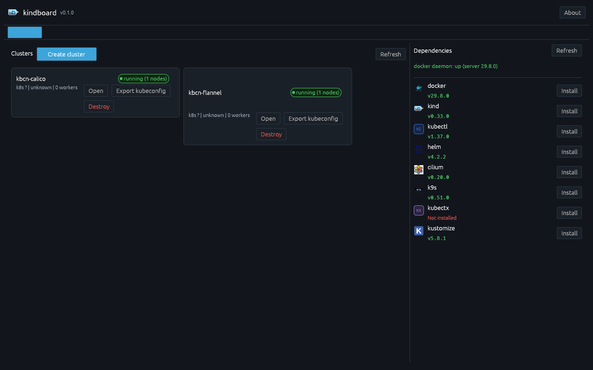
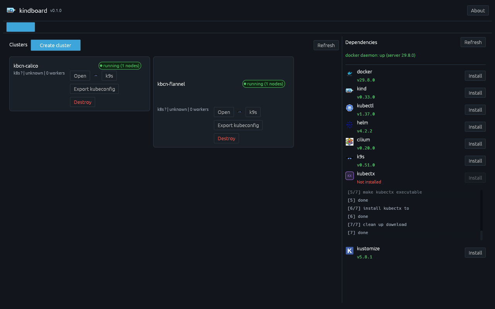
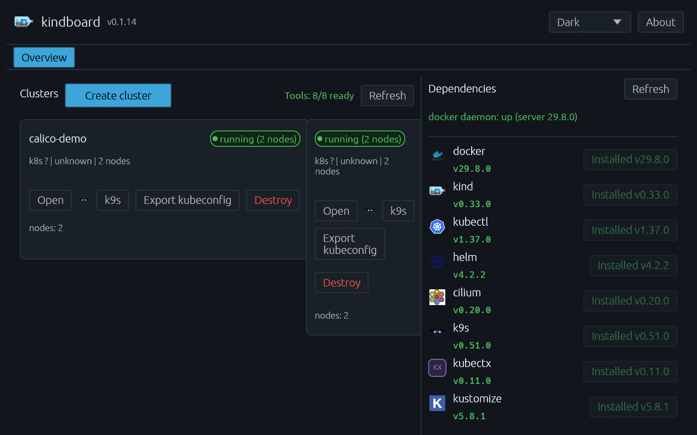

# How to install kubectx with kindboard

kindboard's **Dependencies** panel detects the tools it needs and can install
the missing ones for you — package manager first, official binary with
SHA-256 verification as fallback. This guide walks through installing
[kubectx](https://github.com/ahmetb/kubectx) from the panel.

**Prerequisites:** kindboard running, with a working Docker daemon (only
kubectx matters here, but kindboard probes Docker too). No `sudo` is needed:
the binary fallback installs to `~/.local/bin`.

---

## 1. Open the Dependencies panel

Launch kindboard. The **Dependencies** panel sits on the right side of the
**Overview** tab and lists all eight managed tools with their detected
versions:



Green text = installed version (hover shows the binary path). Red
"Not installed" = missing. Amber "Broken" = present but not working.

## 2. Find kubectx

If kubectx isn't installed, its row shows **Not installed** in red:



> Detection runs automatically at startup. If the state looks stale, click
> **Refresh** to re-detect.

## 3. Click Install

Click the **Install** button on the kubectx row. kindboard streams every
step into the inline log under the row:



What happens under the hood (Fedora/Ubuntu/Arch with no kubectx package):

1. **Download** `kubectx_v0.11.0_<os>_<arch>.tar.gz` from the official
   [kubectx GitHub releases](https://github.com/ahmetb/kubectx/releases).
2. **Verify** the archive's SHA-256 against a digest pinned in kindboard
   (from the release's `checksums.txt`). A mismatch aborts the install —
   the file is never executed.
3. **Extract** the `kubectx` binary and **install** it to `~/.local/bin`
   with the executable bit set.
4. **Re-detect** and report the final state.

On macOS with Homebrew, kindboard uses `brew install kubectx` instead.

## 4. Verify

A green **install succeeded** line plus the version in the row means it's
done:



Confirm from a terminal:

```bash
$ kubectx --version
0.11.0
$ which kubectx
/home/<you>/.local/bin/kubectx
```

`~/.local/bin` must be on your `PATH` (kindboard assumes it is; most
desktop setups already include it).

---

## Notes

- **kubens** ships in a *separate* upstream archive and is not installed by
  kindboard. `brew install kubectx` installs both on macOS; see
  [the upstream README](https://github.com/ahmetb/kubectx#installation) for
  other options.
- **Version pinning:** kindboard installs the exact release pinned in its
  registry (kubectx v0.11.0 at the time of writing) so installs are
  reproducible and checksum-verifiable.
- **Re-detection:** if a tool row ever looks stale, **Refresh** re-runs
  detection. If a detection run stalls (rare worker race), kindboard
  re-runs it automatically within ~30 seconds.

## Troubleshooting

| Symptom | Fix |
|---|---|
| "Not installed" right after an install | `~/.local/bin` missing from `PATH`; add it and reopen the app |
| `install failed: verify kubectx (sha256)` | Archive didn't match the pinned digest (network corruption/proxy); click Install again |
| Install button stays disabled | A detection run is in flight; wait ~30 s (it self-heals) or restart the app |
| kubectx works but shows "Broken" | `kubectx --version` fails; reinstall or fix your `PATH` |

## For maintainers: capturing documentation screenshots

kindboard supports headless screenshot capture for docs/CI:

```bash
# One capture after the UI settles, then exit (delay = wait for detection):
kindboard --screenshot docs/howtos/screenshots/01-deps-panel.png --screenshot-delay 20

# Periodic captures (e.g. to record an install sequence):
kindboard --screenshot-every 1 --screenshot-dir /tmp/seq/
```

Rendering works headlessly with software GL:
`WGPU_BACKEND=gl LIBGL_ALWAYS_SOFTWARE=1` on an Xvfb display. The screenshots
in this guide were produced with those flags — pixel-perfect, no clicks.

Extra knobs for themed / sized captures:

```bash
# A specific window size (verify small frames): KINDBOARD_WINDOW_SIZE=WxH
# A specific theme: point XDG_DATA_HOME at a dir whose kindboard/settings.json
#   contains {"remember_last_wizard":true,"poll_interval_secs":5,"theme":"light"}
# Open the create wizard on the first frame:  KINDBOARD_OPEN_WIZARD=1
# Open a cluster tab once the first reconcile lands: KINDBOARD_OPEN_CLUSTER=<name>
```
