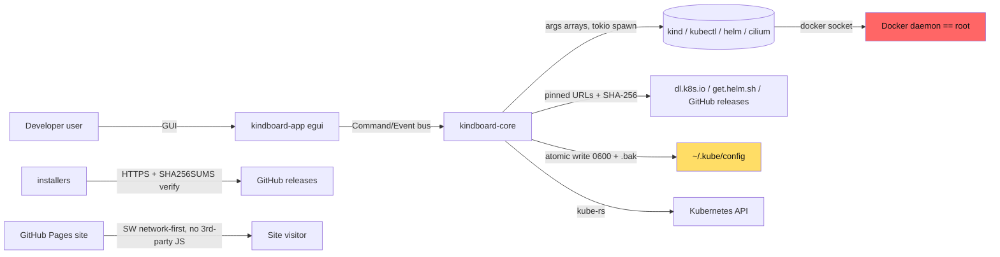

# kindboard — Threat Model

> Living document. Last reviewed: 2026-09-15 (enterprise-compliance pass;
> see ADR-0027).

kindboard is a desktop app with root-equivalent reach on the developer's
machine: it can talk to the Docker daemon (which is effectively root), rewrite
`~/.kube/config`, and download + execute developer tooling. This document
draws the trust boundaries, lists the threats considered, and states the
mitigation for each.

## 1. System graph

**Trust boundaries:** (a) UI ↔ core — the UI can never touch the network or
disk directly; (b) core ↔ external tools — subprocess boundary, args arrays
only; (c) machine ↔ internet — downloads are pinned and verified; (d) repo
↔ release consumers — release artifacts are signed and attested.

## 2. Threats & mitigations

| # | Threat | Entry point | Mitigation | Status |
|---|---|---|---|---|
| T1 | Command injection via cluster name/version/feature-gate values | spec fields → subprocess args | Every spawn is an args array, never `sh -c` (ADR-0009). Values are validated (name charset, version format) in `spec`. | ✅ in place |
| T2 | Malicious/mitm'd tool download (kind, kubectl, helm, cilium, k9s…) | `crates/kindboard-core/src/deps/registry.rs` download + extract | Pinned version + hardcoded SHA-256 digests transcribed from official upstream checksum assets; download fails closed on mismatch. HTTPS (`--proto '=https'` in scripts). | ✅ in place |
| T3 | Kubeconfig corruption or exfiltration | `kubeconfig.rs` edits | Atomic write + `.bak` of previous file + user-private permissions; symlink-attack covered by tests; tokens scrubbed from error tails. | ✅ in place |
| T4 | Release artifact tampering (installer MITM / compromised CI) | GitHub releases + installers | Installers verify SHA256SUMS over HTTPS (release immutability) and refuse on mismatch; release artifacts are keyless-signed (cosign) for out-of-band/manual verification; SLSA provenance attestation; SBOM per release. | ✅ added 2026-09 |
| T5 | Secrets leaking via repo or CI logs | git history, logs | gitleaks on every push/PR over full history; secret-scanning by GitHub; `.env` gitignored; scrubbing tests in core. | ✅ added 2026-09 |
| T6 | Supply-chain compromise of Rust crates | Cargo.lock | `cargo audit` (RustSec) + `cargo deny` (license/bans/sources) on every push/PR + weekly schedule; dependency review on PRs; dependabot keeps the lockfile current. | ✅ added 2026-09 |
| T7 | XSS / script injection on the website | `web/` (static Pages) | No third-party JS; no user content; CSP via meta tag (script-src with inline-hash for the theme bootstrap); SW is network-first for release-changing files. | ✅ added 2026-09 |
| T8 | Malicious cluster (created elsewhere) attacking the app | Kubernetes API responses → topology/log parsers | Core parses API responses defensively; no panics on external input (verified: zero unwrap/expect outside tests in core); log buffers bounded. | ✅ in place |
| T9 | Compromised build host producing malicious binaries | local `make release` | CI-built releases are the canonical channel (attested + signed); local builds remain a documented convenience. | ⚠️ accepted (see §3) |
| T10 | Installer script shenanigans (PATH hijack, root execution) | `scripts/install-*` | User-scoped installs (no sudo) on macOS/Windows; `set -euo pipefail`; `--proto '=https'`; idempotent; checksum refusal on mismatch. | ✅ in place |

## 3. Accepted / residual risks

- **T9 — local builds.** `make release` on a compromised machine can produce
  malicious binaries that the checksums would then "verify". This is inherent
  to any self-built toolchain. Mitigation: prefer CI-built releases; CI
  attestation gives end-to-end provenance for the canonical channel.
- **Apple SDK redistribution.** The local macOS cross-build path
  (`scripts/darwin-env.sh` → `bootstrap-darwin.sh`) downloads a community
  redistribution of Apple's macOS SDK (joseluisq/macosx-sdks) as a build-time
  convenience; it is never shipped. CI releases build natively on
  macOS runners and do not use this path. Organizations with strict Apple
  license review should use the CI releases.
- **Windows zip reproducibility.** CI-built Windows zips are not
  byte-reproducible (zip timestamps). Integrity is provided by
  SHA256SUMS + cosign + provenance, not reproducibility. Deterministic zips
  remain available via the local cross-build path.
- **Docker daemon = root.** kindboard intentionally drives Docker; any tool
  that does so inherits Docker's privileges. The app does not request
  elevated privileges of its own.
- **Desktop app signing.** CI artifacts are cosign-signed but not
  platform-code-signed (no Apple notarization, no Windows Authenticode).
  See docs/macos-distribution.md for the notarization notes. For enterprise
  distribution, add code signing with an organization certificate.
