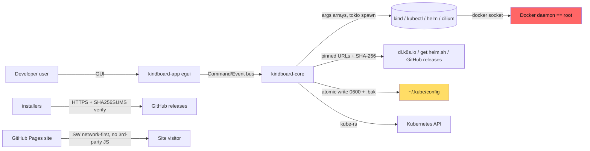

# kindboard — Threat Model

> Living document. Last reviewed: 2026-09-15 (local-first pipeline;
> see ADR-0028).

kindboard is a desktop app with root-equivalent reach on the developer's
machine: it can talk to the Docker daemon (which is effectively root), rewrite
`~/.kube/config`, and download + execute developer tooling. This document
draws the trust boundaries, lists the threats considered, and states the
mitigation for each.

## 1. System graph

**Trust boundaries:** (a) UI ↔ core — the UI can never touch the network or
disk directly; (b) core ↔ external tools — subprocess boundary, args arrays
only; (c) machine ↔ internet — downloads are pinned and verified; (d) repo
↔ release consumers — installers verify SHA256SUMS over HTTPS and refuse on
mismatch; macOS binaries are notarized.

## 2. Threats & mitigations

| # | Threat | Entry point | Mitigation | Status |
|---|---|---|---|---|
| T1 | Command injection via cluster name/version/feature-gate values | spec fields → subprocess args | Every spawn is an args array, never `sh -c` (ADR-0009). Values are validated (name charset, version format) in `spec`. | ✅ in place |
| T2 | Malicious/mitm'd tool download (kind, kubectl, helm, cilium, k9s…) | `crates/kindboard-core/src/deps/registry.rs` download + extract | Pinned version + hardcoded SHA-256 digests transcribed from official upstream checksum assets; download fails closed on mismatch. HTTPS (`--proto '=https'` in scripts). | ✅ in place |
| T3 | Kubeconfig corruption or exfiltration | `kubeconfig.rs` edits | Atomic write + `.bak` of previous file + user-private permissions; symlink-attack covered by tests; tokens scrubbed from error tails. | ✅ in place |
| T4 | Release artifact tampering (installer MITM / compromised build host) | GitHub releases + installers | Installers verify SHA256SUMS over HTTPS and refuse on mismatch; releases are immutable once published; macOS binaries are notarized and stapled locally. | ✅ added 2026-09 |
| T5 | Secrets leaking via the repository or error/log output | git history, logs | `.env` is gitignored; core ships scrub tests so kubeconfig tokens never reach error tails; with no CI, there is no remote secrets surface. | ✅ added 2026-09 |
| T6 | Supply-chain compromise of Rust crates | Cargo.lock | `make audit` (cargo-audit/RustSec) + `make deny` (cargo-deny licenses/bans/sources/advisories against `deny.toml`) run before every release; the lockfile is reviewed on each dependency change. | ✅ added 2026-09 |
| T7 | XSS / script injection on the website | `web/` (static Pages) | No third-party JS; no user content; CSP via meta tag (script-src with inline-hash for the theme bootstrap); SW is network-first for release-changing files. | ✅ added 2026-09 |
| T8 | Malicious cluster (created elsewhere) attacking the app | Kubernetes API responses → topology/log parsers | Core parses API responses defensively; no panics on external input (verified: zero unwrap/expect outside tests in core); log buffers bounded. | ✅ in place |
| T9 | Compromised build host producing malicious binaries | local `make release` | Releases are built locally on the author's machine; a compromised build host could produce malicious binaries that the checksums would then "verify". Accepted and documented (see §3). | ⚠️ accepted (see §3) |
| T10 | Installer script shenanigans (PATH hijack, root execution) | `scripts/install-*` | User-scoped installs (no sudo) on macOS/Windows; `set -euo pipefail`; `--proto '=https'`; idempotent; checksum refusal on mismatch. | ✅ in place |

## 3. Accepted / residual risks

- **T9 — local builds.** `make release` on a compromised machine can produce
  malicious binaries that the checksums would then "verify". This is inherent
  to any self-built toolchain, and it is the accepted cost of the local-first,
  zero-CI pipeline. Mitigation is limited to SHA256SUMS verification by
  installers and macOS notarization (which detects tampering of a signed
  artifact after build, not a maliciously built binary).
- **Apple SDK redistribution.** The local macOS cross-build path
  (`scripts/darwin-env.sh` → `bootstrap-darwin.sh`) downloads a community
  redistribution of Apple's macOS SDK (joseluisq/macosx-sdks) as a build-time
  convenience; it is never shipped. Native macOS builds (Xcode Command Line
  Tools, and Developer ID notarization) use Apple's own SDK. Organizations
  with strict Apple license review should build on macOS with the licensed
  Xcode SDK.
- **Windows zip reproducibility.** The Windows zip is not byte-reproducible
  (zip timestamps). Integrity is provided by the SHA256SUMS file, which
  installers verify over HTTPS — not by reproducibility.
- **Docker daemon = root.** kindboard intentionally drives Docker; any tool
  that does so inherits Docker's privileges. The app does not request
  elevated privileges of its own.
- **Desktop app signing.** macOS binaries are notarized and stapled locally
  when the notarization credentials are set; the Windows zip is unsigned
  (SmartScreen/MOTW is neutralized by `scripts/install-windows.ps1` at install
  time). See docs/macos-distribution.md for the notarization notes. For
  enterprise distribution, add platform code signing with an organization
  certificate.
